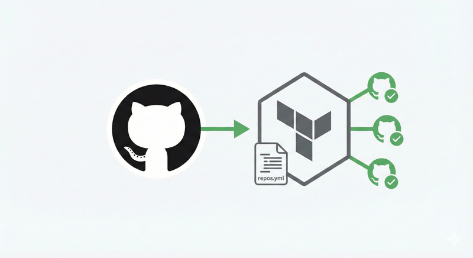

# GitHub As YAML

Manage your GitHub organization's repositories as code using Terraform and YAML configuration.

<!-- markdownlint-disable MD033 -->
<p align="center">
  
</p>
<!-- markdownlint-enable MD033 -->

## Usage

```hcl
module "github_org" {
  source  = "gjed/config-as-yaml/github"
  version = "~> 1.0"

  config_path = "${path.root}/config"
}
```

Consumers must configure the GitHub provider in their own root module:

```hcl
provider "github" {
  owner = "your-org-name"
}
```

See the [consumer example](examples/consumer/) for a complete setup.

## Features

- **YAML-based configuration** - Human-readable repository definitions
- **Configuration groups** - Share settings across multiple repositories (DRY)
- **Repository rulesets** - Enforce branch protection and policies
- **GitHub Actions permissions** - Control which actions can run and workflow permissions
- **Webhook management** - Configure CI/CD and notification webhooks as code
- **Subscription-aware** - Gracefully handles GitHub Free tier limitations
- **Onboarding script** - Easily import existing repositories

## Requirements

| Name | Version |
|------|---------|
| Terraform | >= 1.0 |
| github provider | ~> 6.0 |

A GitHub Personal Access Token with `repo` and `admin:org` scopes is required.

## Inputs

| Name | Description | Type | Default | Required |
|------|-------------|------|---------|----------|
| `config_path` | Absolute path to the directory containing `config.yml`, `group/`, `repository/`, `ruleset/`, and `webhook/` subdirectories. Consumers should set this to `"${path.root}/config"`. Must be a static string. | `string` | n/a | yes |
| `webhook_secrets` | Map of webhook secret names to their values. Keys should match the `VAR_NAME` in `env:VAR_NAME` patterns used in webhook configurations. | `map(string)` | `{}` | no |

## Outputs

| Name | Description |
|------|-------------|
| `repositories` | Map of managed repositories with their URLs, SSH URLs, and visibility |
| `repository_count` | Total number of managed repositories |
| `organization` | GitHub organization being managed |
| `subscription_tier` | GitHub subscription tier |
| `subscription_warnings` | Warnings about features unavailable on current subscription tier |
| `duplicate_key_warnings` | Warnings about duplicate keys in config files |

## Configuration Structure

The `config_path` directory should contain:

```text
config/
├── config.yml              # Organization name, subscription tier, global settings
├── group/                  # Configuration groups (one or more YAML files)
│   ├── base.yml
│   └── oss.yml
├── repository/             # Repository definitions (one or more YAML files)
│   └── repositories.yml
├── ruleset/                # Ruleset definitions (one or more YAML files)
│   └── rulesets.yml
└── webhook/                # Webhook definitions (optional, one or more YAML files)
    └── webhooks.yml
```

### Example Configuration

```yaml
# config/repository/repositories.yml
terraform-modules:
  description: "Shared Terraform modules"
  groups: ["base", "oss"]
  topics: ["terraform"]

api-gateway:
  description: "Internal API gateway"
  groups: ["base", "internal"]
```

## GitHub Subscription Tiers

| Feature | Free | Pro | Team | Enterprise |
| ------- | ---- | --- | ---- | ---------- |
| Public repo rulesets | Yes | Yes | Yes | Yes |
| Private repo rulesets | No | Yes | Yes | Yes |
| Push rulesets | No | No | Yes | Yes |
| Actions permissions | Yes | Yes | Yes | Yes |

Unsupported features are automatically skipped based on your subscription tier.

## Using as a Template (Forking)

This repository can also be used directly as a template. See the
[Quick Start Guide](https://github.com/gjed/terraform-github-config-as-yaml/wiki/Quick-Start)
for fork-based setup instructions.

### Commands (for forked usage)

```bash
make init      # Initialize Terraform
make plan      # Preview changes
make apply     # Apply changes
make validate  # Validate configuration
```

## Documentation

- [Quick Start Guide](https://github.com/gjed/terraform-github-config-as-yaml/wiki/Quick-Start) - Get up and running
- [Configuration Reference](https://github.com/gjed/terraform-github-config-as-yaml/wiki/Configuration-Reference) -
  All available options
- [Using as a Module](https://github.com/gjed/terraform-github-config-as-yaml/wiki/Using-as-a-Module) -
  Reusable module setup and migration guide
- [Customization Guide](https://github.com/gjed/terraform-github-config-as-yaml/wiki/Customization) - Extend the template
- [Examples](https://github.com/gjed/terraform-github-config-as-yaml/wiki/Examples) - Common configuration patterns
- [Troubleshooting](https://github.com/gjed/terraform-github-config-as-yaml/wiki/Troubleshooting) - Common issues and solutions

## License

[Apache 2.0](LICENSE)
