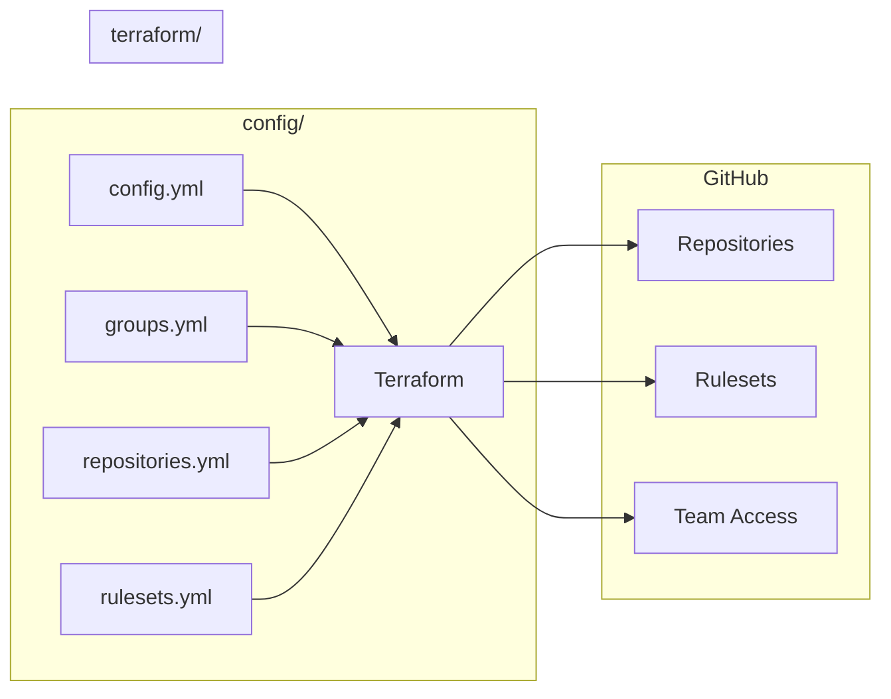

# GitHub Organization Terraform Template

Manage your GitHub organization's repositories as code using Terraform and YAML configuration.

<!-- markdownlint-disable MD033 -->
<p align="center">
  
</p>
<!-- markdownlint-enable MD033 -->

## Features

- **YAML-based configuration** - Human-readable repository definitions
- **Configuration groups** - Share settings across multiple repositories (DRY)
- **Repository rulesets** - Enforce branch protection and policies
- **Subscription-aware** - Gracefully handles GitHub Free tier limitations
- **Onboarding script** - Easily import existing repositories

## How It Works



## Quick Start

```bash
# 1. Use this template on GitHub, then clone your repository

# 2. Set your GitHub token
export GITHUB_TOKEN="your_github_token"

# 3. Configure and apply
make init && make plan && make apply
```

See the [Quick Start Guide](docs/QUICKSTART.md) for detailed setup instructions.

## Example Configuration

```yaml
# config/config.yml
organization: acme-corp
subscription: team

# config/groups.yml
base:
  has_issues: false
  has_wiki: false
  delete_branch_on_merge: true
  teams:
    platform: admin
    developers: push

oss:
  visibility: public
  has_issues: true
  has_discussions: true
  license_template: apache-2.0
  topics:
    - open-source
  rulesets:
    - oss-main-protection

internal:
  visibility: private
  teams:
    security: pull

# config/repositories.yml
terraform-modules:
  description: "Shared Terraform modules for infrastructure"
  groups: ["base", "oss"]
  topics:
    - terraform
    - infrastructure
  homepage_url: "https://acme-corp.github.io/terraform-modules"

api-gateway:
  description: "Internal API gateway service"
  groups: ["base", "internal"]
  has_wiki: true
  rulesets:
    - strict-main-protection

# config/rulesets.yml
oss-main-protection:
  target: branch
  enforcement: active
  conditions:
    ref_name:
      include: ["~DEFAULT_BRANCH"]
  rules:
    - type: pull_request
      parameters:
        required_approving_review_count: 1
        dismiss_stale_reviews_on_push: true
    - type: required_status_checks
      parameters:
        required_checks:
          - context: "ci"
```

## Documentation

- [Quick Start Guide](docs/QUICKSTART.md) - Get up and running
- [Configuration Reference](docs/CONFIGURATION.md) - All available options
- [Customization Guide](docs/CUSTOMIZATION.md) - Extend the template

## Requirements

- [Terraform](https://www.terraform.io/downloads.html) >= 1.0
- GitHub Personal Access Token with `repo` and `admin:org` scopes

## Commands

```bash
make init      # Initialize Terraform
make plan      # Preview changes
make apply     # Apply changes
make validate  # Validate configuration
```

## GitHub Subscription Tiers

| Feature | Free | Pro | Team | Enterprise |
| ------- | ---- | --- | ---- | ---------- |
| Public repo rulesets | Yes | Yes | Yes | Yes |
| Private repo rulesets | No | Yes | Yes | Yes |
| Push rulesets | No | No | Yes | Yes |

The template automatically skips unsupported features based on your subscription tier.

## License

[Apache 2.0](LICENSE)
